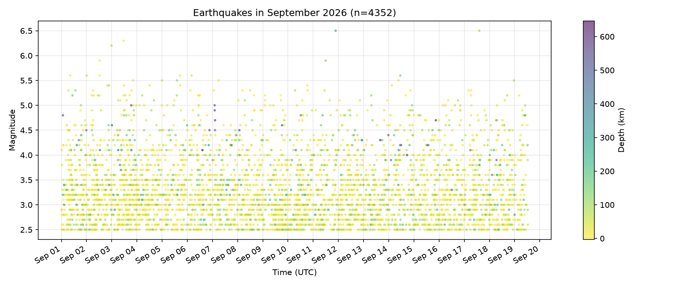

# quakes-this-month



## The phenomenon

Every day, the ground moves. Most of these movements are too small to feel,
but a global network of seismometers records them anyway — thousands of
tiny tremors each month, plus a handful of large ones that make the news.
I chose earthquakes because the data is a rare thing: a natural phenomenon
that is genuinely unpredictable, measured continuously, and published openly
in something close to real time.

## The source

The numbers come from the **EMSC Seismic Portal** (European-Mediterranean
Seismological Centre), fetched from:

`https://www.seismicportal.eu/fdsnws/event/1/query?format=json&starttime=2026-09-01&endtime=2026-09-30&minmag=2.5`

The file is GeoJSON. Each row is one earthquake; `properties.mag` is the
magnitude (Richter scale, dimensionless), `properties.time` is the origin
time in ISO 8601 format, and `properties.depth` is the depth in kilometres.
The cached file contains **4352 rows** — every earthquake of magnitude 2.5
and above recorded worldwide between 1 and 19 September 2026. The URL asks
for the whole month, but the file was fetched on 19 September, so the last
eleven days had not happened yet; the committed file is a snapshot of that day.

## What the picture shows

Each dot is one earthquake. Horizontal position is when it happened,
vertical position is its magnitude, and colour is its depth below the
surface. The picture makes two things visible: earthquakes are spread
evenly across the nineteen days — they are not clustered in time, because
they are not predictable — and they are overwhelmingly shallow, with the
deepest few reaching several hundred kilometres.

What the picture hides: location. Two earthquakes at the same time and
magnitude, one in Chile and one in Japan, land on the same spot. The
map's geography is invisible here; this is a chart about *when* and
*how big*, not *where*. It also hides everything below magnitude 2.5,
which is the majority of what happens.

## How to run it

```bash
uv run fetch.py   # fetches once, saves to data/ — needs the internet
uv run plot.py    # reads data/, writes out/quakes_september.png